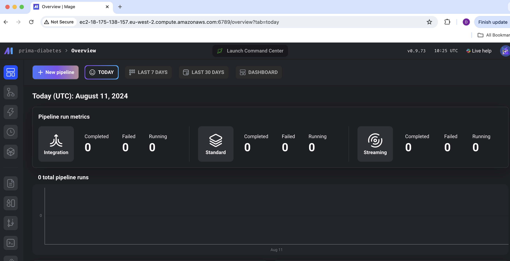
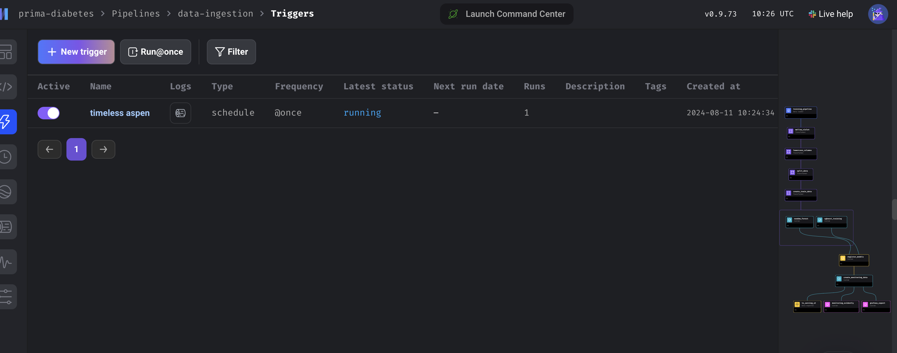
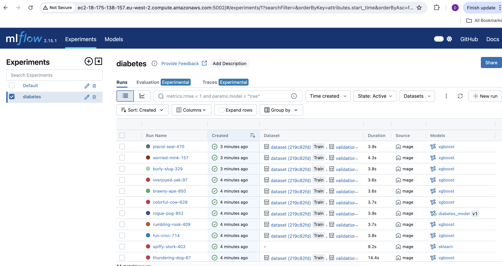
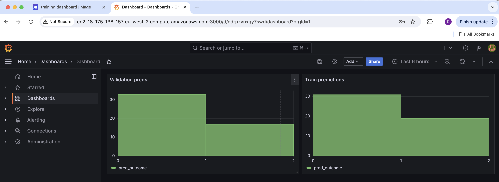

# MLOps Project for Pima Diabetes Prediction

This project is part of the [MLOps Zoomcamp](https://github.com/DataTalksClub/mlops-zoomcamp) course provided by [DataTalks.Club](https://datatalks.club/).

The dataset used in this project was sourced from [Kaggle](https://www.kaggle.com/datasets/uciml/pima-indians-diabetes-database). Preliminary data analysis was conducted (see the [notebooks](/nbs) folder) to gain insights and guide further development.

## Problem Statement: Predicting Diabetes Risk in Patients

### Background

Diabetes is a major health concern globally, including among the Pima Indian population. The Pima Indians Diabetes Database contains medical and demographic data that can be used to predict the likelihood of diabetes in individuals. Developing an accurate predictive model could enable healthcare professionals to identify high-risk patients and intervene early, potentially improving health outcomes.

### Objective

The objective of this project is to develop a predictive model that assesses the risk of diabetes in Pima Indian women based on their health metrics. The model should predict the likelihood of diabetes given an individual's medical and demographic information. This project follows a systematic approach, beginning with data exploration and analysis, and culminating in the deployment and monitoring of a fully automated machine learning pipeline.

The pipeline is built using a combination of the following technologies:

- **Terraform**: Infrastructure provisioning
- **MageAI**: Workflow orchestration
- **MLflow**: Experiment tracking and model management
- **Evidently**: Model performance monitoring
- **Grafana**: Visualization
- **Hyperopt**: Hyperparameter optimization

## Technologies Used

- **Python**
- **Terraform**
- **AWS** (Kinesis, S3, EC2, ECR)
- **Docker**
- **Jupyter**
- **Pipenv/Pyenv**
- **Scikit-learn**
- **XGBoost**
- **MLflow**
- **Evidently**
- **Grafana**
- **Mage AI**
- **Hyperopt**
- **Pytest**
- **Pre-commit** (black, flake8)

## Project Workflow

### 1. Data Exploration and Analysis

The project begins with data exploration and preliminary analysis using Jupyter notebooks, which includes:

- **Loading and Inspecting the Data**: Using Jupyter to load the Pima Indians Diabetes dataset and examine its structure.
- **Exploratory Data Analysis (EDA)**: Understanding data distribution, identifying patterns, and detecting anomalies or missing values. This step includes:
  - Visualizing the distribution of features and target variables
  - Analyzing correlations between features
  - Identifying and handling missing or outlier data points
- **Feature Engineering**: Creating new features or transforming existing ones to improve model performance.

### 2. Building and Orchestrating the Pipeline

Following data exploration and preprocessing, the next phase involves building an automated machine learning pipeline. This pipeline is designed to be modular, scalable, and easily deployable across various environments.

- **Model Testing, Registry, and Deployment**: Using MLflow and MageAI for testing, model registry, and deployment.
- **Model Monitoring**: Implementing monitoring with Grafana and Evidently.
- **Infrastructure Setup**: Utilizing Terraform to provision project infrastructure on AWS, including Kinesis Streams (Producer & Consumer), Lambda (Serving API), S3 Bucket (Model artifacts), and ECR (Image Registry).

These services are accessible via assigned ports on the EC2 instance's DNS.

### 3. Continuous Integration and Continuous Deployment (CI/CD)

CI/CD practices are applied to automate testing and deployment, ensuring the project is robust and maintainable.

## Project Setup

### Prerequisites

1. **AWS IAM User**: Create a Terraform IAM user for infrastructure provisioning on AWS.
2. **S3 Bucket**: Create an S3 bucket named **tf-state-bucket-3** in the **eu-west-2** AWS region.

### Installation Steps

1. Clone the repository:

   ```bash
   git clone https://github.com/Dakini/MLops_project.git
   ```

2. Navigate to the project directory:

   ```bash
   cd MLops_project
   ```

3. Create a virtual environment using Pipenv:

   ```bash
   pip install pipenv
   pipenv shell
   ```

4. Install dependencies:

   ```bash
   make setup
   ```

5. Deploy infrastructure using Terraform:
   ```bash
   cd infrastructure
   terraform init
   terraform plan -var-file=vars/stg.tfvars
   terraform apply -var-file=vars/stg.tfvars
   ```

### Accessing Services

After Terraform completes the infrastructure provisioning, it will output variables such as the EC2 DNS and public IP. You can SSH into the EC2 instance using the following command:

```bash
ssh -i ssh-key.pem ec2-user@<YOUR EC2 IP ADDRESS>
```

You can access the following services via a web browser:

- **Mage AI**: Accessible at `http://<ec2PublicDNS>:6789`.

  - To initiate the data-ingestion pipeline, navigate to the "Pipelines" section, select "data-ingestion," and trigger it with the `@run-once` option. This pipeline will handle data ingestion, transformation, MLflow experiment tracking, model registration, and more.

  

  - The pipeline also includes Hyperopt parameter tuning for XGBoost models and exports predictions to a PostgreSQL database, enabling Grafana to generate relevant plots. Evidently is used to explore statistics related to the dataset. You can explore and modify the pipeline's code directly through the Mage AI service, or by accessing the local code [here](/orchestration/prima-diabetes).

  

- **MLflow**: Accessible at `http://<ec2PublicDNS>:5002`. This service provides a comprehensive view of the experiments that have been run, along with the registered models. You can view the experiments and model aliases through the MLflow interface.

  
  

- **Grafana**: Accessible at `http://<ec2PublicDNS>:3000`. Grafana offers a basic dashboard displaying statistics on model predictions for both training and testing datasets. The default login credentials are:

  - **Username**: admin
  - **Password**: admin

  

### Testing

Run the integration test:

```bash
cd ..
make integration_test
```

### Kinesis Stream Test

Test the Kinesis Stream:

```bash
export KINESIS_STREAM_INPUT=input-kinesis-steam-prima-diabetes
aws kinesis put-record \
--stream-name ${KINESIS_STREAM_INPUT} \
--partition-key 1 --cli-binary-format raw-in-base64-out \
--data '{
"data": {
      "Pregnancies": 0,
      "Glucose": 131,
      "BloodPressure": 0,
      "SkinThickness": 0,
      "Insulin": 0,
      "BMI": 43.2,
      "DiabetesPedigreeFunction": 0.27,
      "Age": 26
      },
"patient_id": "256"
}'
```

### Destroying Infrastructure

To tear down the infrastructure:

```bash
cd infrastructure
terraform destroy -var-file=vars/stg.tfvars
```

## Project Best Practices

This project was also developed on a Mac with Apple Silicon, so this may explain if there are odd behaviours in the project.

The following best practices were implemented for this project. :

- :white_check_mark: **Problem description**: Clear and understandable problem statement
- :white_check_mark: **Cloud**: Fully cloud-based with Infrastructure as Code (IaC)
- :white_check_mark: **Experiment tracking and model registry**:Utilized for all experiments and models
- :white_check_mark: **Workflow orchestration**: Fully deployed and managed workflow
- :white_check_mark: **Model deployment**: Containerized and deployable to the cloud
- :white_check_mark: **Model monitoring**: Basic monitoring with metrics reporting
- :white_check_mark: **Reproducibility**: Clear instructions, dependency versioning, and ease of use
- :white_check_mark:**Best practices**:

  - [x] Unit tests and integration tests implemented
  - [x] Linter and code formatting tools in place
  - [x] Makefile provided for ease of use
  - [x] CI/CD pipeline established
