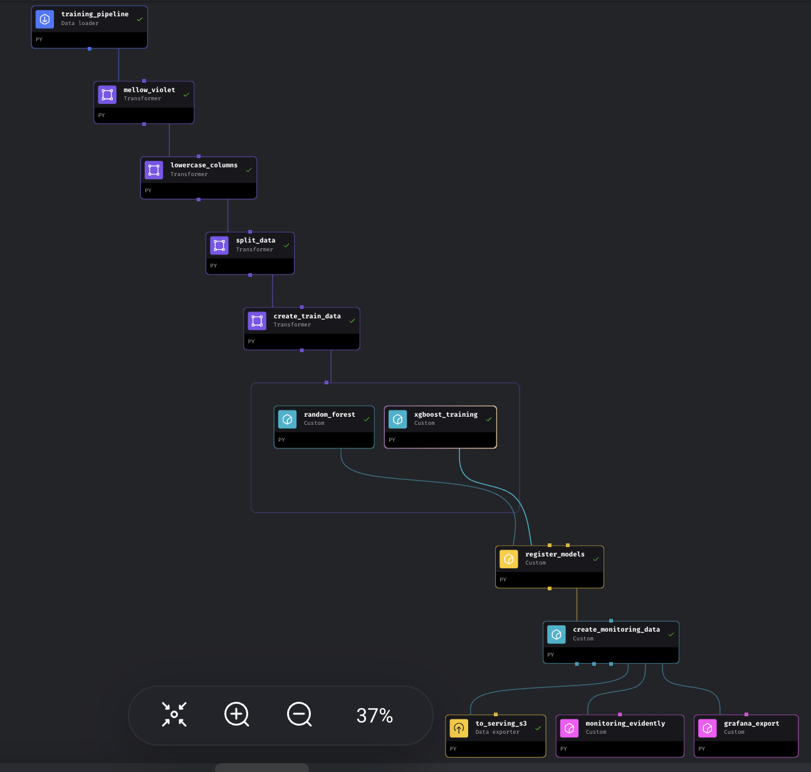

# MLOps project for Prima Diabetes prediction

This project has been developed as part of the [MLOps Zoomcamp](https://github.com/DataTalksClub/mlops-zoomcamp) course provided by [DataTalks.Club](https://datatalks.club/).

The dataset used has been downloaded from [Kaggle](https://www.kaggle.com/datasets/uciml/pima-indians-diabetes-database) and a preliminary data analysis was performed (see [notebooks](/nbs) folder), to get some insights for the further project development.

# Problem Statement: Predicting Diabetes Risk in Patients

### Background:

Diabetes is a significant health issue affecting many individuals worldwide, including the Pima Indian population. The Pima Indians Diabetes Database contains medical and demographic data that can be used to predict the likelihood of diabetes in individuals. By developing an accurate predictive model, healthcare professionals can identify high-risk patients and intervene earlier, potentially improving health outcomes.

### Objective:

The project focuses on the development of a predictive model to assess the risk of diabetes in Pima Indian women based on their health metrics. The model should be capable of making predictions about whether an individual is likely to develop diabetes, given their medical and demographic information. The project follows a systematic approach, starting with data exploration and analysis, and progressing to the deployment and monitoring of a fully automated machine learning pipeline. The pipeline is built using a combination of Terraform for infrastructure provisioning, MageAI for workflow orchestration, MLflow for experiment tracking and model management, Evidently for model performance monitoring, Grafana for visualization, and Hyperopt for hyperparameter optimization.

# Technology Used

- Python
- Terraform
- AWS Kinesis S3 EC2 ECR
- Docker
- Jupyter
- Pipenv/Pyenv
- Sklearn
- XGBoost
- MLflow
- Evidently
- Grafana
- Mage AI
- Hyperopt
-
- Pytest
- Pre-commit (black, flake8)

# Project Description

## Data Exploration and Analysis with Jupyter

The first step in our workflow involves data exploration and preliminary analysis using Jupyter notebooks. This phase includes:

Loading and Inspecting the Data: Using Jupyter to load the Pima Indians Diabetes dataset and inspect its structure.
Exploratory Data Analysis (EDA): Performing EDA to understand the data distribution, identify patterns, and detect any anomalies or missing values. This step may include:

- Visualizing the distribution of features and target variables.
- Analyzing correlations between features.
- Identifying and handling missing or outlier data points.
- Feature Engineering: Creating new features or transforming existing ones to improve model performance.

## Building and Orchestrating the Pipeline

Once the data has been thoroughly explored and preprocessed, the next step involves building an automated machine learning pipeline. This pipeline is designed to be modular, scalable, and easily deployable in various environments.

Afterward, the models underwent testing, model registry, and deployment using MLflow, MageAI. Monitoring of the models was established through Grafana and Adminer Database. Subsequently, a project infrastructure was set up in Terraform, utilizing AWS modules such as Kinesis Streams (Producer & Consumer), Lambda (Serving API), S3 Bucket (Model artifacts), and ECR (Image Registry).

These services can then be accessed at the respective ports assigned to them on the ec2 instance DNS.

There is also some CI/CD applied to this project to run tests regarding the model.

# Project setup

To begin using this repo, please create a terraform IAM user to allow for the creation of infrastructure using AWS. and create a s3 bucket called **tf-state-bucket-3** in the AWS region **eu-west-2**.

After cloneing this repo use the command to begin:

```bash
pipenv shell
make setup
```

The Python version used for this project is Python 3.10.

1. Clone the repo (or download it as a zip file):

   ```bash
   git clone https://github.com/Dakini/MLops_project.git
   ```

2. Create the virtual environment using pipenv:

   ```bash
   pip install pipenv
   pipenv shell
   ```

3. Install setup

   ```bash
   make setup
   ```

4. Execute terraform infrastructure to build the services.

   ```bash
   cd infrastructure
   terraform init
   terraform plan -var-file=vars/stg.tfvars
   terraform apply -var-file=vars/stg.tfvars
   ```

5. Explore the services.
   After terraform has completed its creation of the relevant services. It will output some variables including the ec2 DNS and ec2 public ip.
   It is possible to ssh into the ec2 using the following command

```bash
ssh -i ssh-key.pem ec2-user@<YOUR EC2 IP ADDRESS>
```

It is also possible to view the services for the Grafana, MLFlow and Mage AI. In your web browser. I encourage you to use the mage service first, so that it can fill the MLflow, and grafana service too.

- Mage AI
  If you go to the ec2PublicDNS:6789, you will find the service.
  
  Where if you go to pipelines, open the data-ingestion and use the @run-once trigger it will run the pipeline.
  

The pipeline includes, data ingestion, transforming of data, MlFlow experiment tracking and registration of models for the Lambda function. It also explores hyperopt parameter tuning of XGBoost Models. It also exports the predictions to a postgres database so that Grafana can provide some plts. Evidently is also used to explore some of the stats regarding the dataset.



- MLFlow
  This shows the experiments that have been run, and the alias of the models that have been registerd from the run. If you go to the ec2PublicDNS:5002, you will find the service.
  
  

- Grafana
  This service provides a basic dashboard with some stats regarding the predictions from the model on the training and testing set.
  If you go to the ec2PublicDNS:3000, you will find the service. Login is username: admin, password: admin.
  

6. Execute the integration test

   ```bash
   cd ..
   make integration_test
   ```

7. Test a kinesis Stream

   ```bash
   export KINESIS_STREAM_INPUT=input-kinesis-steam-prima-diabetes
   aws kinesis put-record \
   --stream-name ${KINESIS_STREAM_INPUT} \
   --partition-key 1 --cli-binary-format raw-in-base64-out \
   --data '{
   "data": {
   "Pregnancies": 0,
   "Glucose": 131,
   "BloodPressure": 0,
   "SkinThickness": 0,
   "Insulin": 0,
   "BMI": 43.2,
   "DiabetesPedigreeFunction": 0.27,
   "Age": 26
   },
   "patient_id": "256"
   }'
   ```

8. Destroy infrastruction

```bash
   cd infrastructure
   terraform destroy -var-file=vars/stg.tfvars
```

## Project Best Practices

The following best practices were implemented:

- :white_check_mark: **Problem description**: The project is well described and it's clear and understandable
- :white_check_mark: **Cloud**: The project is developed on the cloud and IaC tools are used for provisioning the infrastructure
- :white_check_mark: **Experiment tracking and model registry**: Both experiment tracking and model registry are used
- :white_check_mark: **Workflow orchestration**: Fully deployed workflow
- :white_check_mark: **Model deployment**: The model deployment code is containerized and can be deployed to the cloud
- :white_check_mark: **Model monitoring**: Basic model monitoring that calculates and reports metrics
- :white_check_mark: **Reproducibility**: Instructions are clear, it's easy to run the code, and it works. The versions for all the dependencies are specified.
- :white_check_mark:**Best practices**:
  - [x] There are unit tests
  - [x] There is an integration test
  - [x] Linter and code formatting are used
  - [x] There is a Makefile
  - [x] There is a CI/CD pipeline
